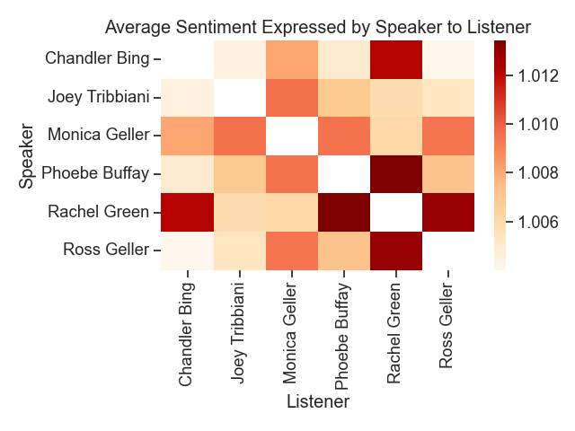
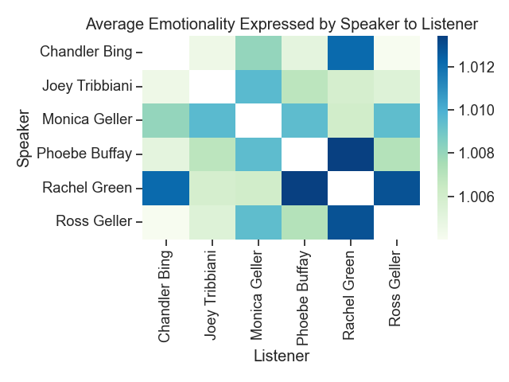

# Intimacy, emotionality, and sentiment among *Friends*
I'm a huge fan of the TV show *Friends*, so when I found a dialogue dataset from all ten seasons I just had to play with it.  I decided to use some NLP methods to quantify a handful of language aspects to see what they revealed about the main characters in the show. 

The first thing I wanted to see was how often each of the different characters speak to each other, which I thought was easiest to see in the following heatmap:

  

The darker green colors show characters who speak to each other the most often.  Looking at this, it's clear that even though this show is called *Friends*, the romantic partners are the ones who converse the most.  Ross and Rachel are the most frequent conversational partners, followed by Monica and Chandler.  What I thought was really interesting, though, was that the pairings who speak to each other the *least* often are the non-romantic mixed-gender pairs.  All of the medium-green boxes represent women talking to other women or men talking to other men, and the very pale green boxes are men talking to women they aren't romantically involved with (or vice versa). Outside of romantic relationships, the women tend to talk to the women, and the men tend to talk to the men.

I quantified three aspects of language - intimacy, sentiment, and emotionality - and evaluated how those aspects vary amongst the characters.

  

Sentiment was quantified using the package VADER Sentiment Analysis (https://github.com/cjhutto/vaderSentiment).

  

