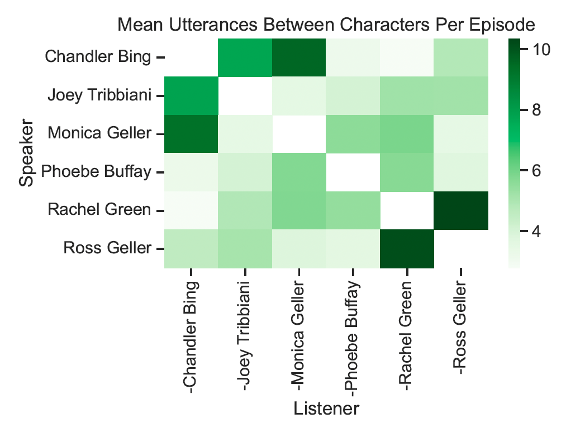
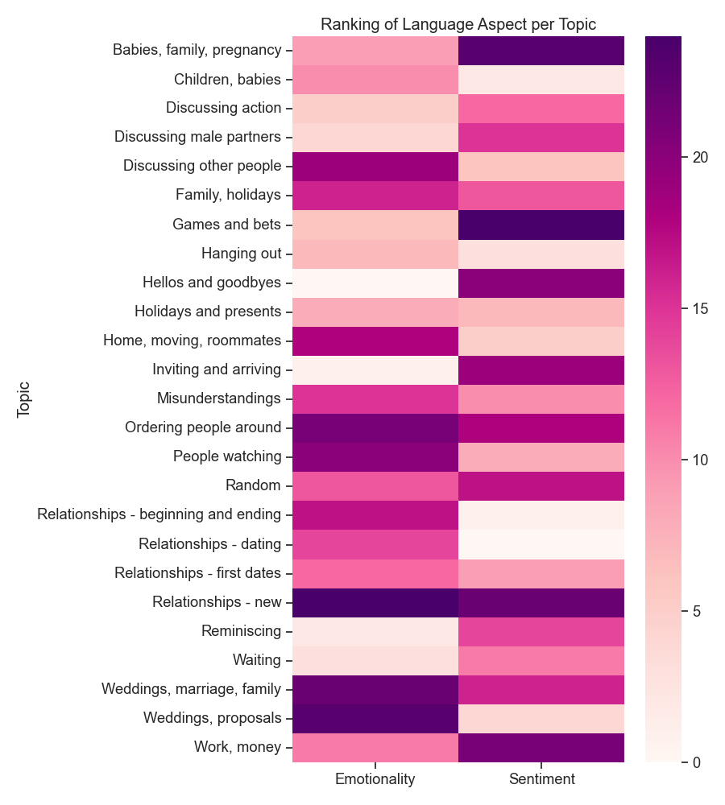

# Intimacy, emotionality, and sentiment among *Friends*
I'm a huge fan of the TV show *Friends*, so when I found a dialogue dataset from all ten seasons I just had to play with it.  I decided to use some NLP methods to quantify a handful of language aspects to see what they revealed about the main characters in the show. 

The first thing I wanted to see was how often each of the different characters speak to each other, which I thought was easiest to see in the following heatmap:

  

The darker green colors show characters who speak to each other the most often.  Looking at this, it's clear that even though this show is called *Friends*, the romantic partners are the ones who converse the most.  Ross and Rachel are the most frequent conversational partners, followed by Monica and Chandler.  What I thought was really interesting, though, was that the pairings who speak to each other the *least* often are the non-romantic mixed-gender pairs.  All of the medium-green boxes represent women talking to other women or men talking to other men, and the very pale green boxes are men talking to women they aren't romantically involved with (or vice versa). Outside of romantic relationships, the women tend to talk to the women, and the men tend to talk to the men.

## Affect

Next I wanted learn more about the affects characters express in conversation with each other.  To do this, I quantified three aspects of language - intimacy, sentiment, and emotionality - and evaluated how those aspects vary amongst the characters.

  

Sentiment was quantified using the package VADER Sentiment Analysis (https://github.com/cjhutto/vaderSentiment).  Darker colors are indicative of more positive sentiment, while lighter colors are indicative of less positive (but still positive!) sentiment.  All of the *Friends* showed positive sentiment in conversations with each other.  The characters also demonstrated reciprocal levels of sentiment in conversations with each other - if one character expressed high levels of sentiment to another, that second character expressed equally high levels of sentiment in return.

  

Emotionality was quantified using methods laid out in a study which evaluated emotion and reason in political language (Gennaro and Ash 2022, http://gloriagennaro.rbind.io/publication/ash_gennaro/).  Vector representations were made based on words that represented two poles of emotionality - high emotionality vs low emotionality - and a vector representation was made based on the words in each utterance in the dialogue corpus.  The strength of emotionality was quantified based on whether the utterance vector was more similar to the highly-emotional vector or the low-emotional vector.  Emotionality followed the same pattern as sentiment - characters expressed similar levels of emotionality in conversation with each other.

  

Intimacy was quantified using the package Question-Intimacy (https://github.com/Jiaxin-Pei/Quantifying-Intimacy-in-Language).  In this scale, questions are rated on a scale of (-1, 1), where positive numbers indicate greater intimacy, and negative numbers indicate less intimacy.  Intimacy didn't follow the same pattern as emotionality and sentiment - for example, Rachel is very intimate in what she says to Chandler, but he's not intimate at all in return.

## Topics

Finally, I wanted to explore what topics are frequently discussed, who tends to participate in those conversations, and what affect is expressed with each topic.  I used the package Tomotopy (https://github.com/bab2min/tomotopy) to generate topics.  This was much more challening that I'd expected, largely because the *Friends* don't tend to have very cohesive conversations, but with some tweaking of model settings I was able to get 25 topics that seemed fairly cohesive.

  

The above heatmap shows the probability of each character participating in a conversation about each topic - darker colors represent higher probability.  There were many topics that centered around romanic relationships, and those topics tended to have a pretty even distribution of character probability - all six main characters participate equally in discussion of romantic relationships.  Topics with more variation in character probability were generally not focused on romantic relationships, such as those focused on waiting for others to arrive, reminiscing about the past, inviting and arriving to events, and discussing other people. This may be a sign that conversations focused on relationships are more universal – it is a theme common to many topics and is of interest to all the main characters – while conversations focused on other things are less universal, as they are unique themes and not all characters are equally invested in these topics.

I was curious if and how aspect varied across topics.  I wasn't able to analyze intimacy, as Question-Intimacy only rates intimacy in questions, and not all topics had conversations with questions.  However, I was able to look at sentiment and emotionality.

  

To make the above heatmap, I found the average sentiment and emotionality scores for all conversations in each topic, and then ranked them in order from highest to lowest scores. 0 (light colors) have the lowest score for that affect, and 24 (dark colors) has the highest score for that aspect.

Looking at the topics this way makes it clear why there are so many different topics centered around seemingly similar themes.  For example, there are four categories I titled “Relationships” with different subtitles – “beginning and ending”, “dating”, “first dates”, and “new”. All four have higher levels of emotionality compared to many other topics, but the level of sentiment is not consistent. The two topics I subtitled “beginning and ending” and “dating” have extremely low levels of sentiment (in fact, they are the two topics with the lowest overall sentiment) while the topic “new” has extremely high sentiment.

## Thank you for reading this!

I had a lot of fun playing with this data and learning more about the characters we all know and love.  When I have time I'm hoping to dig into sarcasm and see how that interacts with everything else!
